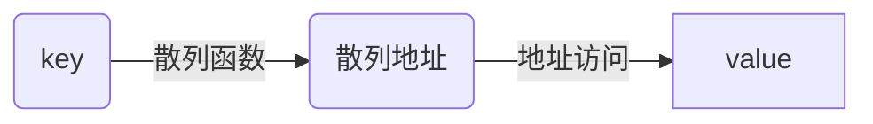

# 线性表
### 一、存储方式
*******
#### 1.1 线性存储
*******
#### 1.2 链式存储
*******
##### 1.2.1 单向链表
##### 1.2.2 双向链表
##### 1.2.3 循环链表
### 二、特殊线性表
*******
#### 2.1 数组
相同数据类型的数据按照顺序在连续内存空间存放  
访问方式：根据下标访问  
* 缺点：内存空间地址连续，增删时需要移动其他元素。  
* 优点：直接访问。  
【C++：要注意vector 和 array的区别，vector的底层实现是array，严格来讲vector是容器，不是数组。】
![image][1]  
******
**二维数组**

#### 2.2 链表
数据域+指针域，不连续存放  
访问方式：根据指针对下一个数据进行访问。  
* 缺点：查找效率低（顺序查找），多余空间  
* 优点：自由度高，易增删  
![image][2]
#### 2.3 字符串
#### 2.4 栈
线性表，后进先出  
常用操作：push，pop  
#### 2.5 队列
线性表，先进先出  
#### 2.6 散列表（哈希表）
数据结构：key-value  
效率：O(1)

**常见散列函数**：  
直接寻址法
数字分析法
平方取中法
取随机数法
除留取余法
**常见冲突处理**：  
开放地址法:
再哈希法
链地址法
公共溢出区法
![image][3]
### 三、查找排序&算法分析
*******
[1]:./数组.png
[2]:./数组和链表.png
[3]:./链地址法.png

