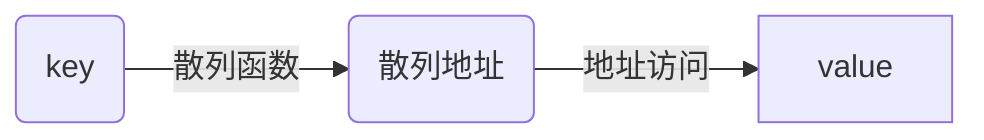

# 线性表
### 一、存储方式
*******
#### 1.1 线性存储
*******
#### 1.2 链式存储
*******
##### 1.2.1 单向链表
##### 1.2.2 双向链表
##### 1.2.3 循环链表
### 二、特殊线性表
*******
#### 2.1 数组
相同数据类型的数据按照顺序在连续内存空间存放  
访问方式：根据下标访问  
* 缺点：内存空间地址连续，增删时需要移动其他元素。
* 优点：直接访问。  
【C++：要注意vector 和 array的区别，vector的底层实现是array，严格来讲vector是容器，不是数组。】
![数组][1]  

**常用算法：**
* **[二分查找](https://github.com/youngyangyang04/leetcode-master/blob/master/problems/0704.二分查找.md)：有序数组中查找无重复元素**  
  暴力破解：O(n)  
  二分查找：O(logn)  
  重点掌握两头闭合和左闭右开两种写法  
  [**二分查找更多变种：**](https://leetcode-cn.com/problems/find-first-and-last-position-of-element-in-sorted-array/solution/yi-wen-dai-ni-gao-ding-er-fen-cha-zhao-j-ymwl/)
![二分查找及其变种][5]
注意点：  
1. 不可写成:``mid = (left+right)/2``，这样可能会溢出，可写为：
   ``mid = left +(right-left)/2``或`` left + ((right - left ) >> 1) ``  
2. ``while(left <= right)``
3. ``left = mid + 1``或``right = mid - 1``，避免死循环。  
* **[移除元素](https://github.com/youngyangyang04/leetcode-master/blob/master/problems/0027.移除元素.md)**   
  暴力破解(双循环法)：O(n^2)  
  双指针法(快慢指针法)：O(n)
* **[滑动窗口](https://mp.weixin.qq.com/s/UrZynlqi4QpyLlLhBPglyg) (用于求数组的子序列)**
* [模拟螺旋矩阵](https://mp.weixin.qq.com/s/KTPhaeqxbMK9CxHUUgFDmg)
******
**字符串**  
**常用算法：**  
* **交换数值：**  
  1. 设置tmp变量。
  2. 通过位运算(异或运算)：
```C++
s[i] ^= s[j];
s[j] ^= s[i];
s[i] ^= s[j];
```
* [**反转字符串**](https://mp.weixin.qq.com/s/X02S61WCYiCEhaik6VUpFA)：双指针法 (可以对比**反转链表算法**)
* [**替换空格**](https://mp.weixin.qq.com/s/t0A9C44zgM-RysAQV3GZpg)：双指针法，分别指向新长度的末尾和旧长度的末尾，从后向前填充。
******
**二维数组**  

存储方式：
C++: 行主序，内存一维连续存储。  
Java：二维数组的每一行头结点的地址是没有规则的，不连续。其二维数组排列如下：
![image][4]
**C++ 参数传递**：(可省略第一维大小)  
```C++
 void Func(int array[3][10]);  
 void Func(int array[][10]);  
```
 但是不能把第二维或者更高维的大小省略，如下面的定义是**不合法**的：  
如 `void Func(int array[3][]); `   
(因为实参传递的数组的起始地址，按照行主列存储，如果不在形参中说明列数，系统无法决定列行的切分，所以不能只指定一维，不指定第二维)

#### 2.2 链表
数据域+指针域，不连续存放  
访问方式：根据指针对下一个数据进行访问。
  
* 缺点：查找效率低（顺序查找），多余空间
* 优点：自由度高，易增删。

![image][2]
#### 2.3 字符串
字符组成的优先序列，即字符数组。  
(注：字符串存入数组时，会以'\0'作为字符串结束的标志。)  
C++:
* 提供string类，提供size接口。
* string很多字符串处理接口，如substr、split、重载了+。

#### 2.4 栈
线性表，后进先出  
常用操作：push，pop  
#### 2.5 队列
线性表，先进先出  
#### 2.6 散列表（哈希表）
数据结构：key-value  
效率：O(1)

**常见散列函数**：  
* **直接寻址法：关键字线性函数。** 
* 数字分析法：从数据中冲突较少部分构造散列地址（位数较长时）。  
* 平方取中法：取平方值的中间几位为散列地址。  
* 取随机数法：取关键字的随机值为散列，即rand(key)。  
* **除留取余法：关键字%m = p，其中m通常为素数或者表长n，且不大于n。**

**常见冲突处理**：  
* 开放地址法：向后移动增量序列(线性探测再散列、二次探测再散列、伪随机探测再散列)。  
* 再哈希法：将关键字的其他部分再哈希。  
* **链地址法：在同一个地址上的值做链表（或使用红黑树提高查询稳定性）。**  
* 公共溢出区法：建立公共溢出区。  
![image][3]
### 三、查找排序&算法分析
*******
[1]:./数组.png
[2]:./数组和链表.png
[3]:./链地址法.png
[4]:./java二维数组.png
[5]:./二分查找及其变种.jpg


